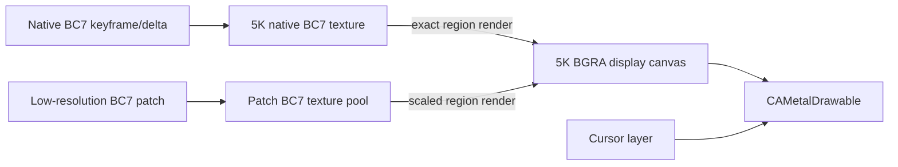

# 5K 局部动态降载 90 FPS 设计

状态：设计草案，不包含实现  
基线：`bc7-5k-gpu-planner-stable-2026-09-26`  
基线提交：`54a1836c81e5177fd081a36aca0eeb6c76fe53f6`

## 1. 目标

在不改变当前稳定模式默认行为的前提下，增加独立的实验模式：

- Receiver 的逻辑画布和最终输出始终为 `5120×2880`。
- 静止区域和未受影响区域始终保持原生 5K BC7 清晰度。
- 只有正在变化且超出帧预算的局部区域临时降低空间分辨率。
- 运动停止或负载下降后，后台恢复受影响区域的原生 5K 内容。
- 优先保持低延迟和接近 90 FPS，不通过排队播放过期帧来制造表面帧率。
- 当前 `54a1836` 路径保持可选且行为不变。

本设计中的“90 FPS”首先表示采集、传输和 Receiver 处理吞吐达到 90
帧/秒。当前 Intel 5K iMac 内屏如果固定为 60 Hz，只能验证处理吞吐，
不能证明物理面板显示了 90 Hz。端到端 90 Hz 显示需要 90/120 Hz
Receiver 面板。

## 2. 已有实机证据

### 2.1 当前稳定版本

当前版本已完成 MacBook Sender 到 Intel iMac Receiver 的 5K 实机验证：

| 指标 | 实测 |
|---|---:|
| GPU tile analysis | `882/882` 帧 |
| 高负载 capture / sent / completed | `45.33 / 45.33 / 45.33 Hz` |
| 高负载 BC7 encode | `5.80 ms/frame` |
| 高负载 planner | `0.492 ms/frame` |
| 高负载 packet serialization | `1.435 ms/frame` |
| 高负载 send completion | `6.095 ms/frame` |
| Sender 高负载网络吞吐 | 平均 `1.841 Gbit/s` |
| Sender 网络峰值 | `3.228 Gbit/s` |
| Receiver 高负载 FPS | 平均 `47.31`，峰值 `56.77` |
| Receiver 网络峰值 | `2.928 Gbit/s` |
| pending | 最大 `1` |
| dropped / fallback / send errors | `0 / 0 / 0` |
| Receiver invalid / render failures | `0 / 0` |

这些数据说明：

1. planner 已不再是主要热点。
2. 当前 Sender 同步阶段
   `encode + plan + packet` 高负载均值约为 `7.73 ms`，低于 90 FPS
   的 `11.11 ms` 单帧周期。
3. 当前 capture callback 只达到约 `45–54 Hz`，尚未证明
   ScreenCaptureKit 能为该配置持续提供 90 FPS。
4. 大范围变化时，网络和 send completion 已成为显著压力。

### 2.2 理论数据量

BC7 每个 4×4 block 使用 16 bytes，即平均 1 byte/pixel：

```text
5120 × 2880 × 1 byte = 14,745,600 bytes/frame
14,745,600 × 90 × 8 = 10.616832 Gbit/s
```

因此 5K 全屏每帧都变化时，仅 BC7 payload 就约为 `10.62 Gbit/s`，
尚未包含 framing、TCP/IP 和重传开销。严格全屏原生 5K 90 FPS 不能依赖
当前 delta 的典型平均值来证明可行。

当前 tile 为 64×64：

```text
每 tile BC7 数据 = 64 × 64 × 1 byte = 4,096 bytes
全屏 tile 数 = 80 × 45 = 3,600
```

局部低分辨率 patch 的数据量近似按像素面积缩放：

| 空间比例 | 数据比例 | 1 MiB 原生 dirty 内容对应 |
|---|---:|---:|
| 1.0× | 100% | 1.00 MiB |
| 0.75× | 56.25% | 0.56 MiB |
| 0.5× | 25% | 0.25 MiB |

实际 packet 还包含 patch metadata、BC7 对齐 padding 和区域合并造成的
额外面积。

按 dirty area 占全屏比例估算，90 FPS 的纯 BC7 payload 为：

| Dirty area | 原生 5K delta | 0.5× 局部 patch |
|---:|---:|---:|
| 10% | `1.06 Gbit/s` | `0.27 Gbit/s` |
| 25% | `2.65 Gbit/s` | `0.66 Gbit/s` |
| 50% | `5.31 Gbit/s` | `1.33 Gbit/s` |
| 100% | `10.62 Gbit/s` | `2.65 Gbit/s` |

该表不包含区域合并、padding、header 和 TCP/IP 开销，但可以证明局部
0.5× patch 对大面积运动具有四倍的 payload 缩减；对小面积变化则没有
必要启用。

## 3. 为什么不能直接把低分辨率 tile 写进现有 baseline

当前 Sender 和 Receiver 维护同一份固定尺寸的原生 5K BC7 baseline：

- Sender planner 以 64×64 原生 tile 计算 exact dirty 状态和 checksum。
- Receiver 使用相同 tile grid 更新 shadow、Metal BC7 texture 和 checksum。
- 每个 delta 都通过 `sequence`、`base_sequence` 和全局 checksum 验证。

低分辨率 patch 的 block grid、row stride 和像素坐标都与原生 5K
baseline 不同。如果直接复用 `TB_PKT_BC7_TILE_DELTA`：

- Receiver 无法判断低分辨率 block 应覆盖哪个原生 block。
- Sender 和 Receiver 的 checksum baseline 会立即分叉。
- patch 移走后会留下旧窗口、旧背景或不同清晰度内容。
- 后续原生 delta 即使格式合法，也可能基于错误 baseline。

因此局部降载必须是独立于原生 delta baseline 的显示层更新，不能伪装成
现有 0x27 native delta。

## 4. 核心模型：原生权威层与 5K 显示画布分离

Receiver 新增两个逻辑层：

1. **Native baseline**
   - 仍是当前 5K BC7 texture、CPU shadow、tile checksums 和 native sequence。
   - 只接受现有原生 keyframe、原生 delta 和后续的原生 repair。
   - 代表 Sender 与 Receiver 共同认可的精确 5K 状态。

2. **Display canvas**
   - 固定为 `5120×2880` 的 BGRA render-target texture。
   - 是当前真正显示给用户的画面。
   - 原生更新时，从 native BC7 texture 将对应区域渲染到 canvas。
   - 降载时，将低分辨率 BC7 patch 线性放大后覆盖到对应局部区域。
   - Cursor 最后单独绘制，始终保持原生坐标和清晰度。



Display canvas 解决了低清 patch 移动后的残影问题：每个 patch 都把当前
源画面写入目标区域，包括窗口新位置、窗口旧位置暴露出的背景和阴影变化。
它不依赖长期存在的 overlay mask。

额外显存的主要部分是 5K BGRA canvas：

```text
5120 × 2880 × 4 = 58,982,400 bytes ≈ 56.25 MiB
```

还需要原生 BC7 texture 约 14.06 MiB，以及有限数量的 patch texture。
该开销必须在 Intel iMac 的实际 Metal device 上测量。

## 5. Tile 状态模型

Sender 和 Receiver 都维护 80×45 的 tile quality map。每个原生 tile
只有两种必要状态：

- `exact`：display canvas 中该 tile 与当前已提交的原生 baseline 一致。
- `degraded`：display canvas 中该 tile 最近由低分辨率 patch 覆盖，需要
  后续原生 repair。

状态转换：

```text
native keyframe       -> 所有 tile = exact
native exact delta    -> 对应 tile = exact
scaled patch          -> 对应 tile = degraded
native repair         -> 对应 tile = exact
session reset/error   -> 清空状态并请求 native keyframe
```

`degraded` 不表示 Receiver 数据损坏。它是可观测、可恢复的画质状态，
不能计入 `invalid` 或 `render failure`。

## 6. Sender 每帧决策

### 6.1 输入

控制器使用以下数据：

- ScreenCaptureKit dirty rects。
- dirty rect 覆盖的原生 tile 数和原生 BC7 bytes。
- 最近窗口的 `encodeMs`、`planMs`、`packetMs`、send completion。
- `pendingVideoPackets` 和 completed throughput EWMA。
- 当前 degraded tile 数量和最长 degraded age。
- 连续超预算或低于预算的帧数。

### 6.2 帧预算

90 FPS 的周期为 `11.11 ms`。控制器同时维护两个预算：

1. **时间预算**
   - 使用各阶段 p95，而不是一秒均值。
   - 为 capture jitter 和 Receiver 留出 headroom。

2. **字节预算**
   - 根据最近完成发送吞吐计算：

   ```text
   packetBudget =
       completedBytesPerSecond / targetFPS × utilizationFactor
   ```

   - `utilizationFactor` 必须小于 1，防止把正常网络抖动转化为排队。

初始阈值必须通过实验确定，不能直接把当前一次实测峰值当作链路容量。

### 6.3 决策顺序

每帧按以下顺序处理：

1. 将 dirty rect 扩展到 64×64 原生 tile 边界。
2. 合并重叠或距离很近的区域。
3. 估算原生 delta bytes。
4. 如果原生更新满足时间和字节预算，发送现有 native delta。
5. 如果超预算，只对超预算区域生成 scaled patch。
6. 未进入 scaled patch 的 dirty tiles 仍可发送原生 delta。
7. 剩余预算用于修复最老的 degraded tiles。
8. 如果状态不可信、dirty metadata 缺失或协议切换失败，发送 native
   keyframe，不静默继续。

这意味着同一 source frame 可以在一个 atomic adaptive frame 中包含：

- 一组 native exact runs；
- 零个或多个 scaled patches；
- 一组 native repair runs。

Receiver 必须在完整验证三部分后再修改状态，并且每个 source frame 只
present 一次。native baseline sequence 只在 packet 含有 exact native
updates 时推进。

## 7. 局部 patch 生成

### 7.1 Region 构造

不为每个 64×64 tile 单独创建 patch。Sender 将 dirty tiles 聚合为有限
数量的矩形：

- 先合并水平连续 tiles。
- 再合并垂直重叠且间距小于阈值的 runs。
- 限制单帧 patch 数，例如最多 8 个。
- patch 超过数量或 header 开销阈值时，继续合并相邻区域。
- 每个目标区域增加 guard band，避免线性采样在边缘读取错误颜色。

patch destination rect 使用原生 5K 像素坐标，并保持 4 像素对齐。

### 7.2 Scale tier

第一版只需要两个局部档位，避免状态空间过大：

| Tier | Patch 编码比例 | 数据比例 | 作用 |
|---|---:|---:|---|
| Native | 1.0× | 100% | 精确更新和 repair |
| Motion | 0.5× | 25% | 超预算的运动区域 |

0.5× 具有明确的 2:1 坐标映射。0.75× 可作为后续扩展，但它增加
BC7 block 对齐、采样和质量切换复杂度，不应进入首版验证。

### 7.3 GPU 数据流

```text
5K BGRA capture texture
    ├─ native dirty tiles -> existing 5K BC7 encoder
    └─ degraded regions
         -> Metal 0.5× downsample into patch atlas
         -> BC7 encode patch atlas
         -> patch descriptors + atlas blocks
```

patch atlas 将多个低分辨率区域打包到一张临时 texture，减少 command
buffer、buffer allocation 和 encoder dispatch 数量。wire packet 只携带
一份 atlas BC7 blocks；每个 descriptor 记录 atlas source rect 和 5K
destination rect。

## 8. Wire protocol

增加 capability：

```text
supportsBC7AdaptivePatches: true
```

只有 Receiver 明确声明支持时，Sender 才能发送 adaptive packet。旧
Receiver 继续走当前 0x24/0x27 路径。

新增 atomic adaptive frame packet，暂定：

```text
0x29 = BC7_ADAPTIVE_FRAME
```

建议 payload：

```text
u8   formatVersion
u32  generation
u64  frameID
u64  captureTimestampNs
u32  canvasWidth
u32  canvasHeight
u64  nativeBaseSequence
u64  nativeResultSequence
u64  nativeResultChecksum
u16  nativeRunCount
u16  patchCount
u16  atlasWidth
u16  atlasHeight
u32  atlasBytesPerRow
u32  atlasDataLength
u64  atlasChecksum

repeat nativeRunCount:
    existing native run header and native BC7 blocks

repeat patchCount descriptor:
    u16 destinationX
    u16 destinationY
    u16 destinationWidth
    u16 destinationHeight
    u16 atlasSourceX
    u16 atlasSourceY
    u16 atlasSourceWidth
    u16 atlasSourceHeight

u8[atlasDataLength] atlas BC7 blocks
```

约束：

- destination rect 必须位于 5K canvas 内。
- atlas 和 source rect dimensions 必须非零、4 像素对齐。
- atlasDataLength 必须精确匹配 BC7 block 大小。
- source rect 不能重叠非法 padding，也不能超出 atlas。
- patch 数量、单 patch 和总 packet 大小必须有硬上限。
- native result checksum 和 atlas checksum 必须在上传前验证。
- `generation` 在 keyframe、模式切换和 reconnect 时更新。
- `frameID` 必须单调增加；Receiver 丢弃旧 generation 或旧 frameID。
- `nativeResultSequence == nativeBaseSequence` 表示本帧不改变 native
  baseline；否则必须严格等于 `nativeBaseSequence + 1`。

Atlas patch 是自包含画面，不依赖另一个 scaled patch，因此不存在低清
patch baseline 丢失后无法继续的问题。原生 sequence 仍只描述 exact
baseline，`frameID` 描述所有 adaptive visual frames。

使用一个 atomic packet 而不是分别发送 native delta 和 scaled patch，
可以保证 Receiver 在验证全部内容后一次性 apply，并且每个 source frame
只 present 一次。解析或 checksum 任一部分失败时，整帧均不得修改。

## 9. Receiver 合成流程

### 9.1 Native keyframe

1. 验证并上传完整 native BC7 texture。
2. 重建 native shadow/checksum 状态。
3. 将 native texture 全屏渲染到 display canvas。
4. 清空所有 degraded bits。
5. present display canvas。

### 9.2 Adaptive frame

1. 验证 generation、frameID、所有 bounds、stride 和 length。
2. 在修改 shadow 前验证 native sequence 和候选 native checksum。
3. 验证 atlas checksum。
4. 上传 exact native runs 到 native texture，并更新 native shadow。
5. 将 exact 和 repair regions 从 native texture 渲染到 display canvas，
   清除对应 degraded bits。
6. 上传 atlas BC7 blocks 到 patch texture。
7. 按 descriptors 将 atlas regions 放大写入 display canvas，并标记对应
   tiles 为 degraded。
8. 原子提交 native state、quality map 和 frameID。
9. present display canvas 一次。

patch 覆盖区域是不透明替换，不与旧内容做 alpha 混合。guard band 只用于
采样，实际写入受 destination rect 限制，不能污染外部 exact pixels。

## 10. Native baseline 的正确性

当前 Sender GPU analysis 会在分析时更新 GPU baseline。adaptive 模式不能
继续无条件更新，否则 Sender 会把“只发送过低清 patch”的内容误认为
Receiver 已拥有原生版本。

adaptive 模式需要区分：

- `observed current frame`：本次捕获的精确 5K 内容。
- `committed native baseline`：Receiver 已收到的精确 5K 内容。

GPU baseline 只能在对应 native tile 成功进入发送序列时提交。scaled
patch 不改变 native baseline，也不推进 native sequence。

实现上需要 staged analysis：

```text
compare current against committed native baseline
    -> produce dirty/checksum candidates
controller chooses native / scaled / deferred
    -> commit only native and repair tile indices to baseline
```

如果发送失败，不能提交 staged baseline；下一帧继续相对最后成功的
native baseline 计算。该约束必须有 mutation test。

## 11. 恢复清晰度

### 11.1 Repair queue

Sender 维护 degraded tile bitset 和首次降级时间。每帧发送运动内容后，
使用剩余字节预算修复：

1. 已停止变化的 degraded tiles。
2. degraded age 最长的 tiles。
3. 包含文本/高频内容的 tiles；首版可不做内容分类。
4. 当前仍高速变化的 tiles 最后修复，避免立即再次降级。

repair 使用原生 BC7 tile 数据，并参与正常 native checksum 和 sequence。

### 11.2 收敛保证

必须满足：

- 当 source 静止且连接正常时，degraded tile 数单调下降到 0。
- 最长 degraded age 有硬上限。
- 超过上限仍无法修复时发送 native keyframe。
- mode disable、resize、display change、checksum failure 和 reconnect
  都通过 native keyframe 回到全 exact 状态。

## 12. Receiver 当前隐藏成本

当前 `handle_bc7_delta` 每帧执行：

1. `malloc` 一份完整 5K candidate shadow。
2. 复制约 14.75 MB native shadow。
3. 分配并复制 tile checksum 数组。
4. 在验证成功后替换旧 shadow。

在 90 FPS 下，仅完整 shadow copy 的理论内存流量约为：

```text
14.7456 MB × 90 = 1.327 GB/s
```

这还不包括 allocation、free、checksum 和 Metal upload。该成本目前未被
Receiver telemetry 单独测量。

设计上应先从 incoming runs 计算候选 tile checksums，并通过：

```text
candidateGlobal =
    oldGlobal
    XOR oldChecksumsForChangedTiles
    XOR newChecksumsForChangedTiles
```

验证 packet 声明的全局 checksum。验证通过后再原地更新 shadow、
tile checksum 和 Metal texture。这样保持 fail-closed，同时移除每帧
完整 shadow allocation/copy。

## 13. 控制器与 hysteresis

不根据单帧尖峰切换。控制器维护短窗口和长窗口：

- 短窗口：最近 8 帧，用于发现持续超预算。
- 长窗口：最近 90 帧，用于判断恢复。

初始实验阈值：

```text
进入 Motion：
  连续 3 帧 predictedBytes > packetBudget
  OR pending > 1
  OR sender critical-path p95 > 9 ms

退出 Motion：
  连续 45 帧 predictedBytes < 70% packetBudget
  AND pending == 0
  AND sender critical-path p95 < 8 ms
```

这些只是实验起点，不是最终产品常量。最终值必须由实机 sweep 得出。

## 14. Telemetry

Sender 新增：

- target FPS、实际 capture callback Hz。
- native exact tiles、scaled patch tiles、repair tiles。
- exact/degraded tile 数和最大 degraded age。
- scale tier、patch count、atlas occupancy。
- downsample、patch encode、native encode、decision、packet timing。
- predicted bytes、actual bytes、packet budget。
- mode transition 原因。

Receiver 新增：

- native parse/checksum/apply/upload 时间。
- patch parse/checksum/upload/composite 时间。
- present submit 和 completion 时间。
- exact/degraded tile 数。
- patch frameID、native sequence、generation。
- capture-to-receive、capture-to-present 延迟。
- invalid patch、stale patch、repair 和 forced keyframe 计数。

所有时间必须报告 p50/p95/p99 和 max；一秒平均不能替代尾延迟。

## 15. 实验论证计划

### 15.1 阶段 A：不改变画面的测量

目的：判断 90 FPS 输入和 Receiver 预算是否存在。

测试：

1. ScreenCaptureKit 配置 90 FPS，但暂不改变编码格式。
2. 分离 capture callback interval、queue wait、GPU time 和 CPU time。
3. Receiver 分离 parse、checksum、shadow apply、Metal upload、present。
4. 分别运行静止、窗口拖动、滚动、视频、Mission Control 和全屏动画。

通过条件：

- 连续运动 callback p50 ≥ 85 Hz。
- Sender 和 Receiver 都不存在未解释的 >11.11 ms p95 阶段。
- 当前稳定模式关闭实验开关时数据不回归。

如果 source display 或 ScreenCaptureKit 不能提供超过 60 FPS，记录为硬
边界，不用编码吞吐代替 capture 能力。

### 15.2 阶段 B：离线视觉正确性

使用确定性帧序列，不连接网络：

- 黑白 1-pixel 网格。
- 8–14 pt 文本。
- 彩色渐变。
- 窗口在复杂背景上移动。
- 两个远离的区域同时变化。
- 窗口跨越 patch 边界。

逐帧保存：

- 原生 ground truth。
- adaptive display canvas。
- exact/degraded mask。
- repair 后结果。

测量：

- exact 区域必须 bit-exact。
- degraded 区域单独计算 PSNR、SSIM 和最大边缘误差。
- patch 外任何像素变化均视为 correctness failure。
- source 静止后最终 canvas 必须与 native ground truth 一致。

### 15.3 阶段 C：协议和状态机

覆盖：

- 单 patch、多 patch、边缘 patch、最小 4×4 patch。
- malformed dimensions、stride、length、checksum 和越界坐标。
- stale frameID、错误 generation、重复 packet。
- scaled patch 后 native repair。
- scaled patch 中途 keyframe。
- send failure、disconnect、resize 和模式切换。
- native delta 与 scaled patch 同帧交错。

所有无效输入必须显式拒绝；不得以成功形态继续显示或推进 baseline。

### 15.4 阶段 D：性能矩阵

在同一录制输入上比较 stable 与 adaptive：

| 场景 | Dirty 面积 | 重点 |
|---|---:|---|
| Cursor/小动画 | <1% | 不应触发降级 |
| 小窗口拖动 | 5–15% | exact 与 patch 切换 |
| 大窗口拖动 | 25–50% | 90 FPS 和局部清晰度 |
| 双窗口运动 | 分散区域 | patch 合并效率 |
| 全屏滚动 | 80–100% | 带宽极限 |
| 静止恢复 | 0% | repair 收敛时间 |

每个场景至少持续 10 分钟，报告：

- capture/sent/completed/Receiver FPS。
- throughput 与每帧 bytes。
- Sender/Receiver 各阶段 p50/p95/p99。
- end-to-end latency p50/p95/p99。
- degraded area 比例和 degraded age。
- dropped、fallback、invalid、render failure、keyframe request。

### 15.5 网络压力

在可控限速和延迟条件下测试至少：

- 2、3、5、8 Gbit/s 可用吞吐。
- 0、1、3、5 ms 附加 RTT。
- 短时吞吐下降和恢复。

验证控制器不会持续排队，并且带宽恢复后画质可以收敛回 exact。

### 15.6 Mutation tests

每个关键 guard 必须临时删除或反转，确认对应测试真实失败：

- scaled patch 不得推进 native baseline。
- generation/frameID 检查。
- patch bounds 和 dataLength 检查。
- checksum 失败不得修改 display canvas。
- repair 必须清除 degraded bit。
- patch 外像素不得被写入。
- 静止后的收敛保证。
- adaptive disabled 时不得发送 0x29。

测试全绿但 mutation 不失败，说明测试没有覆盖该保证。

## 16. 验收条件

### 正确性

- exact 区域逐像素与原生 ground truth 一致。
- patch 外无视觉变化。
- 静止后所有 degraded tiles 恢复为 exact。
- 所有 sequence/checksum/generation 错误 fail closed。
- 当前 0x24/0x27 Receiver 兼容路径保持不变。

### 性能

- 典型窗口运动连续 10 分钟：
  - capture/sent/completed ≥ 85 FPS；
  - pending ≤ 1；
  - dropped、send errors、invalid、render failures 为 0。
- Sender 和 Receiver 各自关键路径 p95 < 11.11 ms。
- 不以增加队列深度换取表面 FPS。
- 全屏运动单独报告，不与典型窗口运动平均。

### 画质

- exact 区域不允许退化。
- degraded 区域必须在 UI 和 telemetry 中可量化。
- 停止运动后的 native repair 有明确 p95 恢复时间。
- 当前稳定模式关闭 adaptive 后，输出与 `54a1836` 一致。

## 17. 实施边界与顺序

1. 仅补 telemetry，验证 capture 和 Receiver 时间预算。
2. 消除 Receiver 每 delta 的完整 shadow allocation/copy。
3. 引入 display canvas，但仍只渲染 native updates，验证无画质回归。
4. 增加 capability 和 scaled patch parser，不启用自适应。
5. 增加 Sender patch atlas 和固定 0.5× 局部 patch。
6. 增加 degraded map 和 native repair。
7. 增加基于实测数据的控制器和 hysteresis。
8. 完成完整实验矩阵后，才讨论是否从实验模式提升为普通选项。

每一步都必须能单独关闭，并能回到
`bc7-5k-gpu-planner-stable-2026-09-26`。

## 18. 明确不在首版范围

- 不改变当前默认稳定模式。
- 不引入 0.75× 和多个动态 scale tier。
- 不基于窗口语义、OCR 或内容类型做智能区域识别。
- 不使用不可靠传输替代当前 TCP。
- 不用加深队列来隐藏吞吐不足。
- 不宣称当前 60 Hz iMac 能物理显示 90 Hz。
- 不在实验数据出来前承诺全屏原生 5K 等价质量下的 90 FPS。
